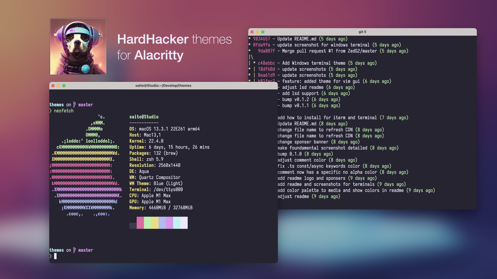

<p align="center">
  
</p>

<h1 align="center">
  HardHacker Theme for Sublime Text
</h1>



## Install using Git

```shell
git clone https://github.com/hardhackerlabs/theme-sublime.git
```

Install theme by Open the Sublime Text, Preferences -> Browse Packages, Copy the Hardhacker.sublime-color-scheme to folder.

Go to Preferences -> Color Scheme -> User and select the Hardhacker Color Scheme to Activate it.
